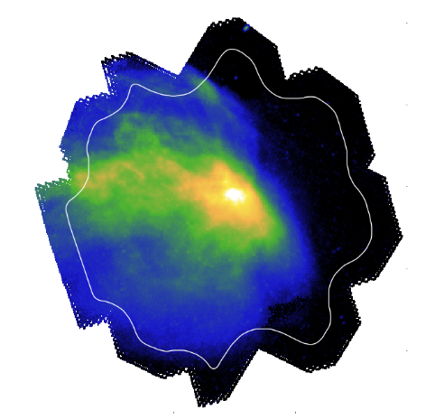

# Introduction

## Purpose

The main objective of this propgram is to create a Fortran module provide a set of tools that allow to study the evolution of a prestellar core. This module is based on a very simple model wich assume that:
- The core present a spherical symetry (behavior fully discribed in 1D)
- Ideal gas lew remain applicable (first steps of the core collapsing)
- The behavior is driven only by the gravity and the internal thermal pressure (no trubulence, no magnetic field, no external pressure etc.)

## Credit

The program was made by:
- Vincent FORIEL
- Julien MONTILLAUD

